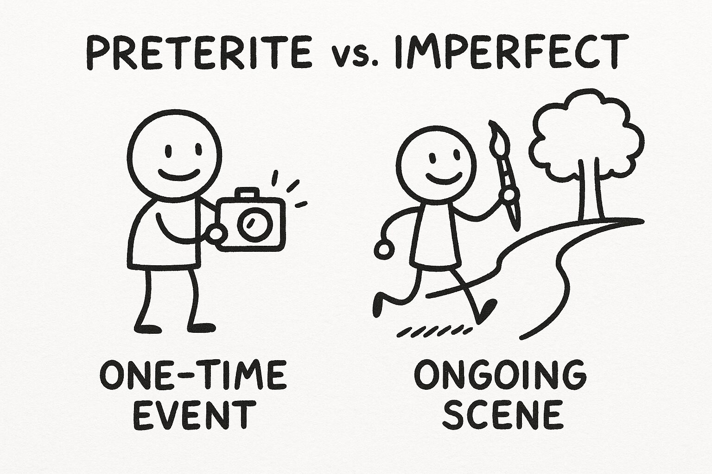

###### Spanish Pd.1 Zyhannah Sandoval 

# Imperfect vs Preterite 
#### Compare and Contrast
##### Preterito
 * Completed action
 * Happened once 
 * Clear beginning/ending
 * specific time mentioned 
 * series of actions in a story

 ##### Similarities
 * Talk about the past
 * Used in stories
 * Describes things that already happened
 * Often used together in the same paragraph 

 ##### Imperfect 
 * Ongoing action in the past 
 * Repeated on habitual action (used to)
* No clear beginning/ending
* Descriptions (feelings, age, weather, time, characteristics) 
* sets the background scene

#### The imperfect describes what was happening, while the preterite describes the action that "interrupted" the ongoing activity.
EX: Miraba (imperfect) la tele cuando sono (preterito) el telèfono. 

