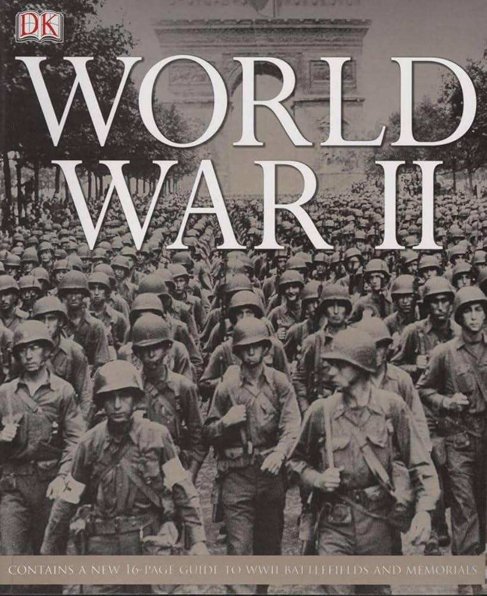

###### History Pd.2 Zyhannah Sandoval 
## World War II
##### General Information 
* Length of war 1939-1945
* 50 million killed 
* 49 countries on the sid ef the Allies
* 8 countries were on the side of the Axis 

#### Alliances
##### The Axis Powers 
* Japan (strong)
* Germany (very strong)
* Italy (weak)
Germany and Japan were short on oil

##### The Allies
* Britain (o.k.)
* France (weak)
* Soviet Union (strong in numbers but poorly equipped)
* United States (strong in numbers and well equipped)
[Joined in late 1941]

### Japanese Aggression
**Military Leader:** Tojo Hideki 

Japanese military was independent of the government 

**Ideology:** Imperalism

**Goal:** Become the dominant power in East Asia 

#### Italian Aggression
**Leader:** Mussolini

**Goal:** Revive the glories of the Roman Empire

**Response:** No sanctions from the League of Nations

### Adolf Hitler
* By July 1932, Hitler's Nazi party became the strongest political party in Germany. 
* The death toll for germans was in the millions. 
* 6 million Jews were exterminated in death camps
* 50 million people will die because of Hitler
* Hitler destroyed Germany. Germany will be divided between victors

