###### Child Development Pd.4 Zyhannah Sandoval 

## Brain Parts Explained

### Cerebrum
The biggest part of the brain is the cerebrum. It is divided into lobes: frontal, parietal, temporal, and occipital lobes. Different parts of the cerebrum work with different parts of the body, like our senses. It controls your voluntary muscles, which are the muscles that move when you want them to. The cerebrum is in charge of thinking, learning, emotions, and problem solving. It helps you remember the answer to 3 x 3 as you try to solve that difficult math problem. 
The cerebrum is divided into two halves, called hemispheres. The left hemisphere helps you with reading, writing, math, speech, and logic. The right side helpes with emotions, music, and understanding our senses. One interesting fact is that the right side of the cerebrum controls the left side of the body and the left side of the cerebrum controls the right side of the body. 
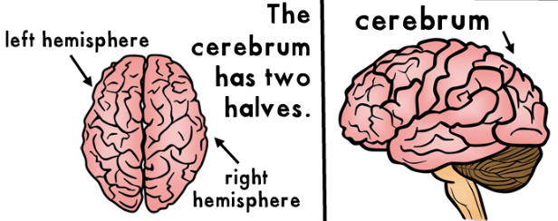

### Cerebellum
The cerebellum is called the "small brain" or "little brain" because it is much smaller than the cerebrum, but still very important for living. The cerebellum is located in the back of the brain, underneath the cerebrum and the pons. The cerebellum controlls balance, movement, muscle tone, and coordination. It is in charge of voluntary tasks like language, walking, and writing. The cerebellum can learn motor movements with practice. This includes things like hitting a baseball with a bat and typing on the computer without looking at the keys! It takes in all messages from the nerves and then figures out what to do with them. Other functions of the cerebellum include the control of speech and maintaining balance. People who have damaged their cerebellum have trouble keeping their balance and coordinating their muscles. 
 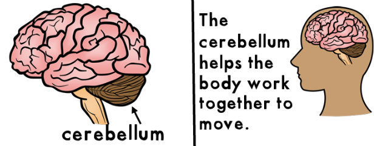

### Brain Stem
The brain stem is the message center of the brain. All messages sent to and from the brain are sent to the brain stem before heading off to their location. The brain stem sits beneath the cerebrum and in front of the cerebellum, connecting the brain to the spinal cord. The brain stem has three main parts: the midbrain, the pons, and medulla oblongata. The brain stem is also in charge pf all the functions that keeps your body alive. This includes breathing, digesting food, hunger, thirst, and circulating blood. Another job of the brain stem is to control the body's involuntary muscles, which work automatically without you thinking about it. The brain stem tells your heart to pump more blood when you are running during recess. It also helps stomach muscles to start digesting the pizza you ate for lunch!
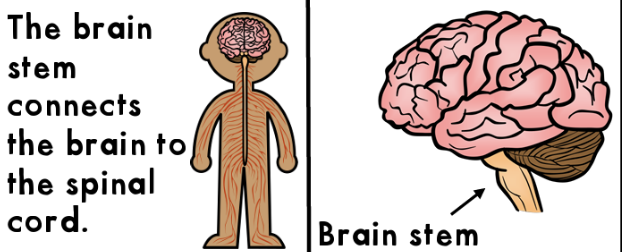

### Pituitary
The pituitary gland, also called the "master gland", is an important part of the endocrine system. The endocrine system is the collection of glands in the body. All of the body's glands are controlled by the pituitary. It is very small, only about the size of a pencil eraser! It is attatched to the hypothalamus at the base of the brain. Its job it to produce and release hormones into your body. Hormones are chemical signals for parts of your body. They are essential to making sure your body stays healthy. One example is the growth hormone. The pituitary gland gives directions through hormones to tell your body to grow. The pituitary gland works with other hormones to make sure your body stays working. It helps regulate growth, reproduction, mood, some behaviors, and stress. Your height and weight are a direct result of hormones released by the pituitary. 
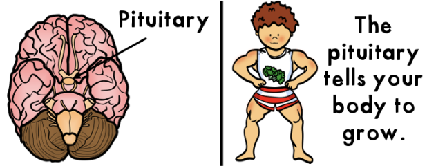

### Frontal Lobe 
The frontal lobe is one of four parts of the cerebrum. It controls our thinking,reasoning, planning,  behavior, attention, problem solving, impulse control,emotions, and movement of the opposite side of the body. The frontal lobe is in charge of our cognitive thinking, which shapes our personality. This part of the brain is what makes you unlike anyone else! The frontal lobe is used everyday for making decisions like what to eat for breakfast and who to play with at recess. It helps us think through and solve that difficult math problem. The frontal lobe is located on the front of the brain, behind our forehead. Injuries to the forehead and top of the head can damage the frontal lobe. Damage to the frontal lobe can cause changes in behavior, attention, emotion, and also weakness on the opposite side of the body. 
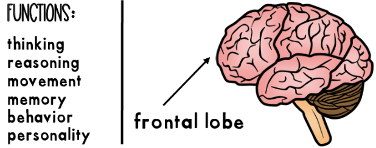

### Temporal Lobe 
The temporal lobe is one of four parts of the cerebrum. The temporal lobe is responsible for learning, hearing, memory, and feelings. It recives sounds and speech from the ears to help us understand what we hear. It helps us make sense of all the different types of sounds around us. With help from the temporal lobe we can distinguish our friend's voice from all the other noises on the playground! The temporal lobe also helps with language comprehension and speech. This means we can put words into sentences to express ourselves. Memory is stored in parts of the temporal lobe. The temporal lobe is located on each side of your brain, next to the ears. Damage to it may cause problems with language and understanding sounds. It can also cause problems with memory. It can even lead to personality changes. 
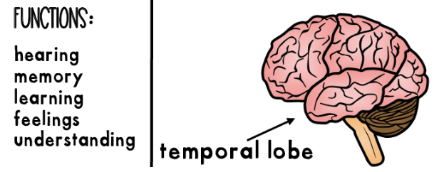

### Olfactory Bulb 
The olfactory bulb is a special organ found in the brain that is responsible for our sense of smell. It is located under the frontal lobes of the brain. Smell, also called olfaction, is one of the body's five main senses. Smells are sent from the nose to the olfactory bulbs where signals are processed in the brain. Our sense of smell works closely with our sense of taste. Smells help us detect flavors in food. Olfaction is so powerful that it can influence our mood and behavior. It can also bring back certain memories. The olfactory bulb is small compared to the size of a human brain, but this is not the case with all animals. Animals that have a very strong sense of smell have a larger olfactory bulb. The olfactory bulb does change in size throughout adulthood. 
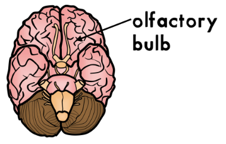

### Pons 
The pons acts like a bridge to connect the upper and lower parts of the brain. It sends messages between parts of the brain and the spinal cord. Without the pons, the brain would not be able to function because messages could not be passed along. The pons also plays a part in our sleeping and dreaming. REM sleep, which is a stage of deep sleep when we dream, starts in the pons. Another function of the pons is to communicate between the two hemispheres of the brain. The pons also helps keep our breathing regular. It is part of the brain stem that sits directly above the medulla. It is located in the rear part of the brain, in a section called the hindbrain. It is small, about 2.5 cm, which is about the size of an olive. Damage to the pons can cause communication problems within the brain. 
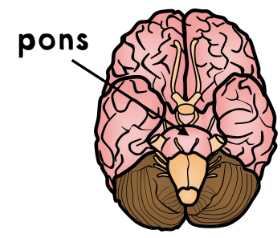

### Medulla Oblongata
The medulla oblongata is considered the most important part of the brain. It connects the brain with the spinal cord. Messages are sent back and forth between your brain and your body through the medulla oblongata. It controls the body's involuntary tasks. These are tasks done without you needing to think about it. This includes breathing, sneezing, coughing, swolling, vomiting, controlling our heart rate, blood pressure, and going to the restroom. The medulla oblongata also coordinates our body movements and helps control our mood. We could not live without the medulla oblongata preforming all these tasks. It is located in the lower part of the brain stem. It sits below the pons and above the spinal cord. Because the medulla controls so many functions, damage to this part of the brain can cause death. 
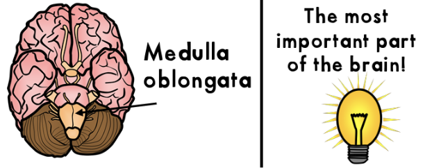

### Hypotalamus
The hypothalamus is the section of the brain that makes most of the body's hormones. Hormones are chemical signals that control different cells and organs in the body. It controls your appetite, thirst, sleeping, emotions, blood pressure, and body temperature. Your body temperature should be about 98.6 degrees. If your body is too hot, the hypothalamus tells your body to sweat. If your too cold, the hypothalamus tells your body to shiver. Both shivering and sweating are your body's ways to get your temperature where it needs to be. It is responsible for keeping your body normal and balances. The hypothalamus is located above the pituitary gland in the center of the brain. It is very small in size, but conntents the endocrine system with the nervous system. 
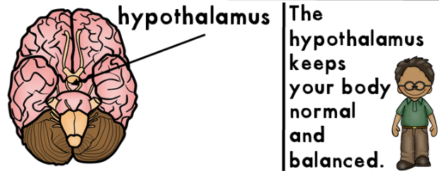

### Parietal Lobe 
The parietal lobe is one of the four parts of the cerebrum. It provides sensory information to the brain (information from your five senses). This includes touch, pain, pressure, and temperature. The parietal lobe tells your brain that your ice cream is cold, soft, and tastes like vanilla! It also helps control coodination, so your spoonful of ice cream makes it to your mouth. The parietal lobe playes an important part in solving math problems and explaining your answers in writing. It is located in the middle of the cerebrum, behind the frontal lobe and above the occipital lobe. It has a right and left side, like other parts of the brain. Damage can cause the loss of sensation down the opposide sid eof the body. This can cause less awareness of parts of the body. 
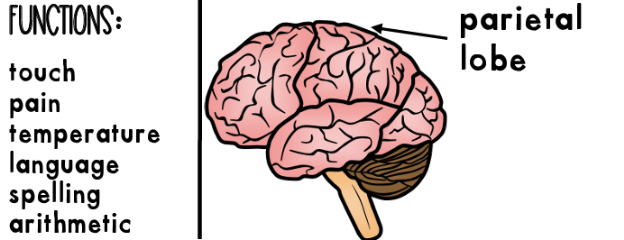

### Occipital Lobe 
The occipital lobe i sone of the four parts of the cerebrum. It helps us understand what we see. This includes objects, colors, shapes, and the distance of objects. For example, the occipital lobe helps us tell the differeces in the letter "V" and the letter "U" and the difference between a circle and a square. The occipital lobe has to be very fast to understand what our eyes are seeing. The occipital lobe is used early in life, beginning in infants. As children grow they begin to understand what they see. The right and left sides of the occipital lobe are located on the bottom back part of the cerebrum. It is the smallest of the lobes. Damage can cause distortion in what we see, which makes objects look different. It can also cause problems identifying everyday objects and colors.
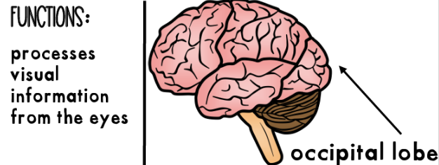