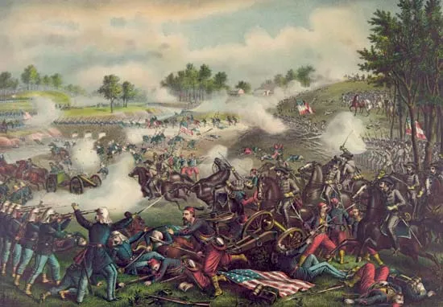

###### English Pd.5 Zyhannah Sandoval 

## The Battle of Bull Run
The Battle of Bull Run (July 21, 1861) was the first major land battle of the American Civil War. It took place near Manassas, Virginia, and is famous for shattering the North’s hope that the war would be won quickly.
The battle began with Union forces attacking the Confederate army in an attempt to seize a key railroad junction. Although the Union initially pushed the Confederates back, the tide turned on Henry House Hill. It was here that General Thomas Jackson earned his nickname "Stonewall" for holding his ground against the assault.
The arrival of Confederate reinforcements by railroad a military first triggered a massive counterattack. The Union army, made up of green, inexperienced soldiers, broke into a panicked retreat. This retreat became known as the "Great Skedaddle" because soldiers and the civilians who had come out from Washington D.C. with picnic baskets to watch the fight all fled back to the capital in total chaos.
The South won the day, and both sides realized the conflict would be a long, bloody struggle rather than a short skirmish.
Would

