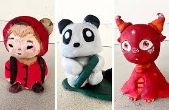

##### Ceramics Pd.7 Zyhannah Sandoval 

## Bobble head
1. Roll clay in a circle 

2. Use pinch method to make it hollow on the inside

3. get another piece of clay and roll as if making a triangle

4. shape the pointy part and make it thinner than the whole body but not too thin just enough to hold the head

5. add details on the head

6. add arms to the body and design

7. put head on body and done 

