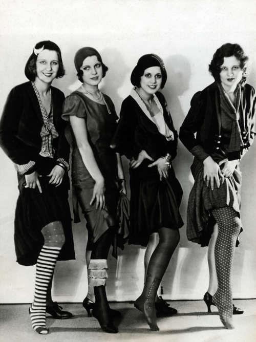

###### Zyhannah Sandoval pd.2 History
# Women in the 1920s
### The 19th Amendment
Some women encouraged other women to fight for their rights. Some of these women included Carrie Chapman Catt, Alice Paul, and Ida B. Wells, who all fought for their women's rights because they were treated less and not as important as men. They were denied basic political power like voting, lacked property/wage rights, and had limited education/career options and suffered inequality in marriage and divorce encouraging them to fight for their rights. Many women refused to fight for their rights because they believed men should be the ones to handle everything. 

### Flappers in the 1920s
Flappers were the iconic young rebellious women from the 1920’s known for their short bobbed haircut, short skirts, and for wearing makeup and energetic dancing. These women were a different type of women than anyone had seen. They loved to go out to parties, drink alcohol, and to smoke in public which was not known for women to do and was prohibited. Flappers were women who were tired of being told what to do, they didn't want to be at home waiting around till they got married they wanted to be like men, they wanted their freedom, they wanted to be able to go out late at night, partying, smoking, and drinking and also have their own money. 

### Famous Flappers
Clara Bow was an actress who was born in New York, Brooklyn on July 29, 1905. Her childhood wasn’t the best as she grew up poor and suffered sexual abuse from her father and neglected by her mentally ill mother. She had won a beauty pageant held by Motion Picture classic magazine, which had helped her career start. She began to take small roles in films and would sometimes do silent films all while she was still in high school. She continued her career till around early 1930’s where she retired at the young age of 28 due to scandals that were going around about her intimate and personal life. She continued to live her life with her husband Rex Bell where they lived a quiet life in a Nevada Ranch until she began to develop an illness and died in 1965. 

<!-- Images -->
[**Flappers in the 1920s**] 