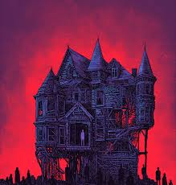

###### Zyhannah Sandoval pd.5 English
# The Fall of the House of Usher 
### “The Fall of the House of Usher” differences 

The movie version of the story “The Fall of the House of Usher” by Edgar Allan Poe, changes the original story by making Madeline the main part of the movie. This is because in the story Madeline was only mentioned once or twice and that she got sick and passed away after that she wasn’t mentioned again but the movie showed something different. The movie showed Madeline good and healthy in the beginning but later on after Philip finally had convinced her to leave the house with him she got into an argument with Usher then fell into a deep sleep where Usher had convinced Philip she was dead. Later on in the movie Philip realized she wasn’t dead and as he went to look for her he found her but as a different person, she was crazy and had blood all over her hands and tried to hurt Usher and Philip. This changed the mood of the story to become more horrified about Madeline proving Usher's point about the family curse. This change also made the characters come off more intense. For example, in the story Usher came off as a sad guy living alone in his big mansion due to the fact that his sister died because of an unknown illness doctors couldn't even discover. Madeline came off as a little girl who sadly died due to the sickness and Philip wasn’t even mentioned in the story. But in the movie Madeline seemed like a girl who was trapped inside her home and wanted out without understanding that she did until Philip came along and tried to help her leave the house and once she decided to leave Usher didn’t like that so he caused her to go into a deep sleep making him seem like the villain. Later on during the movie it showed Madeline cursed and looking scary while making usher look like he did the right thing. I think the director chose to change the story to intensify the plot and make the movie more exciting for the audience. By doing this I think the movie looked a lot better than it did in my head with the book. The movie kept me intrigued and unexpected events that happened throughout the movie made it more exciting because I was expecting exactly what was going to happen in the story. I feel like making changes like these help keep the audience engaged in the story or movie. The director may have also had another vision of how he wanted the story to be told. Another important major change that happened in the movie was that when madeline fell into a deep sleep Usher trapped Madeline in a coffin probably planning to keep her there until she really passed away or until Philip left but anyway this made usher look like the bad guy although he did believe in a curse and just didn’t want Madeline to get killed. In the story this was a different outcome because Usher had said his sister died due to an illness which is kind of true she did have an illness in the movie as well but this came later on but this was also more like part of the curse. 

