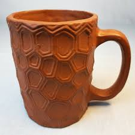

###### Zyhannah Sandoval pd.7 Ceramics
## How to make a cup
1. First get a block of clay, a large paper, cup mold, a roller, and 2 flat sticks
2. Slam the block of clay on the table until flat enough to roll
3. Place on paper 
4. place the 2 sticks on the right and left side of the clay and roll 
5. Roll clay until it can no longer be rolled 
6. Make sure its like a long rectangle then cut the edge of the long side off until its straight
7. Get another paper and wrap it around the cup mold then lay the mold on your clay
8. Roll it until your slab wraps around your whole cup then cut that end
9. Cut the end aswell, score, and stick the two sides together
10. Make another slab if needed and trace a circle using the bottom of your cup
11. Cut the edges diagnoly and score the bottom of your cup
12. Put them together and if you want add details to your cup 

