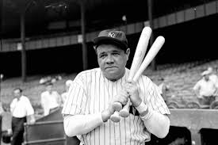

###### Zyhannah Sandoval pd.2 History
# Sports in the 1920s 
## Background facts
Sports in the 1920’s got popular because post-WWI Americans got shorter work weeks and started to earn more money and more free time to spend more time watching sports for need for escape and enjoyment. 1020’s baseball, a decade characterized by the “live-ball era,” which saw a surge in offense, led by superstars like Babe Ruth and a shift in popularity towards Urban Ballparks. Boxing in the 1920’s was a booming glamorous yet gritty sport, moving from semi-legality to mainstream popularity with stars like Jack Dempsey, featuring ethnic pride, huge crowds, less regulation, and the draw of radio broadcasts. 

## The great Jack Dempsey
Jack Dempsey, also known as the “Manassa Mauler,” was a 1920s heavyweight boxing champion known for his aggressive bobbing/weaving style. He later became a popular NYC restaurateur and WW2 coast guard officer. He was born into a poor Mormon family as one of thirteen kids who all struggled. He left home at fourteen, fighting in rough camps to make ends meet. He became a boxer out of necessity, he learned to fight in rough mining towns by challenging men in saloons for money, taking his older brother's name, and eventually getting discovered by manager Jack Kearns. 

## Babe Ruth 
George Herman Ruth was a legendary baseball player who revolutionized the game with his powerful hitting. He set records like hitting 714 career home runs, and becoming one of the first Hall of Fame inductees. Babe Ruth had a troubled youth and was sent to Saint Mary’s Industrial School for boys in Baltimore at the age of seven. There, he learned how to play baseball and was mentored by brother Massias. He was eventually found by the owner of the Baltimore Orioles and was offered to play for him. After only playing for the Baltimore Orioles for a few months he was sold by the owner to the Boston Red Sox for 25 thousand dollars. 

